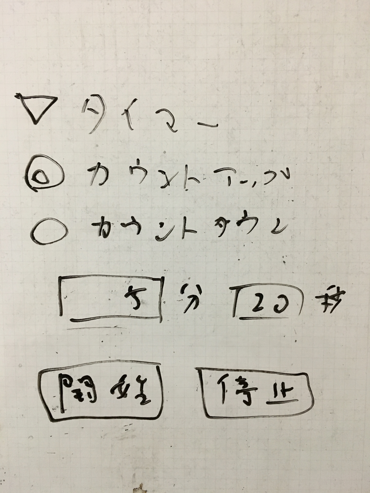

## todo

- タイマー
  - 
- slideshow.html でカーソルキーを入力したときにページ切り替え
- `?presenter=1`がついていたら自動的にビューを発表者モードにする
  - スライドショーは現在は強制的に 1 ページ目から開始するが、現在地のページから開始するように変更
  - `slideshow.html?page=3` replaceState
  - スライドウィンドウを閉じたときにフィードバック https://developer.mozilla.org/ja/docs/Web/API/Window/open
- svelte, marko で書き直し
- コミュニケーションを postmessage から sessionstorage/localstorage に置き換え

```js
// flux standard action
const payload = {
  type: 'REPLACE_PAGE',
  payload: {
    page: 3,
  },
}
postMessage(payload)
```
